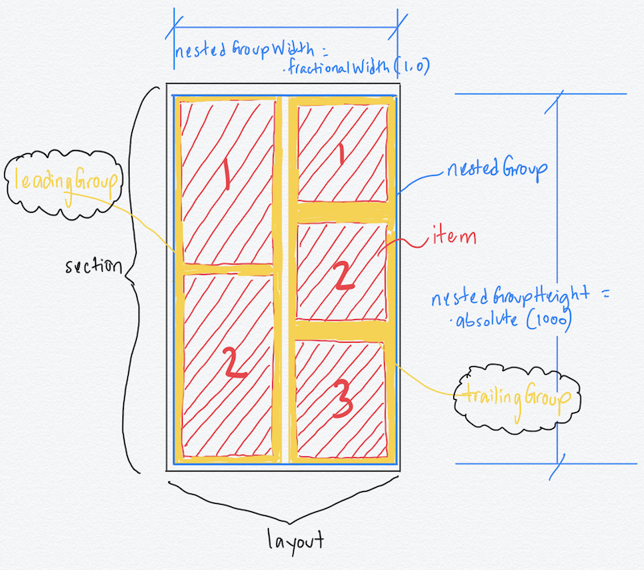

# Using Compositional Layout and Combine




## 1. Objectives 

* Use all we've learnt so far to build a photo search application using a custom compositional layout. 
* Use the `Combine` framework to make asynchronous network requests via a `Publisher` and `Subscriber`. 
* Use `UISearchController` along with the `debounce` Combine operator to prevent multiple network requests from the search bar. 

## 2. Starter Files 

#### ImageCell

```swift 
import UIKit

class ImageCell: UICollectionViewCell {
  
  static let reuseIdentifier = "imageCell"
  
  public lazy var imageView: UIImageView = {
    let iv = UIImageView()
    iv.image = UIImage(systemName: "photo")
    iv.layer.cornerRadius = 8
    iv.clipsToBounds = true
    return iv
  }()
  
  override init(frame: CGRect) {
    super.init(frame: frame)
    commonInit()
  }
  
  required init?(coder: NSCoder) {
    super.init(coder: coder)
    commonInit()
  }
  
  private func commonInit() {
    imageViewConstraints()
  }
  
  private func imageViewConstraints() {
    addSubview(imageView)
    imageView.translatesAutoresizingMaskIntoConstraints = false
    NSLayoutConstraint.activate([
      imageView.topAnchor.constraint(equalTo: topAnchor),
      imageView.leadingAnchor.constraint(equalTo: leadingAnchor),
      imageView.bottomAnchor.constraint(equalTo: bottomAnchor),
      imageView.trailingAnchor.constraint(equalTo: trailingAnchor),
    ])
  }
}
```

#### Config.swift 

```swift 
struct Config {
  static let apikey = "API KEY GOES HERE FOR THE PIXABAY API"
}
```

#### Photo.swift 

```swift 
struct PhotoResultsWrapper: Decodable {
  let hits: [Photo]
}

struct Photo: Decodable, Hashable {
  let id: Int
  let webformatURL: String
}
```

## 3. Combine APIs we will be using in this lesson 

#### `@Published`

Allows any property to be a `Publisher` and emit values over time. e.g in this app as the user enters text into the search bar the subscriber will have access to the values the user enters. This user entered input will then be passed over to the api client to perform the photo search from Pixabay. 

#### `URLSession.shared.dataTaskPublisher(url:_)`

This is a wrapper around `URLSession` that Combine provides and allows us to create a `Publisher` that we will be subscribing on in our view controller to get the results of the photo search. 

#### `debounce`

Allows a scheduled time before carrying out a specific task. In the case of our app we will add a second delay after the user finishes to type before running the network request of their search. This will prevent multiple requests from going to the Pixabay API as the user is typing. 

## 4. `UISearchController` 

Allows you to embed a search bar into the navigation bar item and is a more modern way to carry out searches with some more flexibility as opposed to your standard `UISearchBar` api. Also you can assign a specific view controller to be the results controller among other features `UISearchController` provides. 

## 5. Create an `enum` to hold the collection view's sections 

In this app we will have only 1 section. 

```swift 
enum SectionKind: Int, CaseIterable {
  case main
}
```

## 6. Declare the collection view 

```swift 
private var collectionView: UICollectionView!
```

## 7. Declare the data source 

```swift 
typealias DataSource = UICollectionViewDiffableDataSource<SectionKind, Photo>
private var dataSource: DataSource!
```

## 8. Declare the search controller 

```swift 
private var searchController: UISearchController!
```

## 9. Declare a search text `@Published` property 

This property will be a `Publisher` and be able to emit values as it's changed. 

```swift
@Published private var searchText: String? = "paris"
```

## 10. Declare a property the will hold references to all the subscriptions in our app

Those subscriptions will be released from memory when `deinit` is called on the view controller. 

```swift 
private var subscriptions: Set<AnyCancellable> = []
```

## 11. Declare an instance of the API client 

```swift 
private let apiClient = APIClient() 
```

## 12. Create the collection view's layout using compositional layout 

In this layout with have a leading and a trailing group embedded in a container group. The leading group has 2 items vertically aligned and the trailing group has 3 items vertically aligned. 

```swift 
private func createLayout() -> UICollectionViewLayout {
  let layout = UICollectionViewCompositionalLayout { (sectionIndex, layoutEnvironment) -> NSCollectionLayoutSection? in
    let itemSize = NSCollectionLayoutSize(widthDimension: .fractionalWidth(1.0), heightDimension: .fractionalHeight(1.0))
    let item = NSCollectionLayoutItem(layoutSize: itemSize)
    let itemSpacing: CGFloat = 5
    item.contentInsets = NSDirectionalEdgeInsets(top: itemSpacing, leading: itemSpacing, bottom: itemSpacing, trailing: itemSpacing)

    let innerGroupSize = NSCollectionLayoutSize(widthDimension: .fractionalWidth(0.5), heightDimension: .fractionalHeight(1.0))

    let leadingGroup = NSCollectionLayoutGroup.vertical(layoutSize: innerGroupSize, subitem: item, count: 2)
    let trailingGroup = NSCollectionLayoutGroup.vertical(layoutSize: innerGroupSize, subitem: item, count: 3)

    let nestedGroupSize = NSCollectionLayoutSize(widthDimension: .fractionalWidth(1.0), heightDimension: .absolute(1000))
    let nestedGroup = NSCollectionLayoutGroup.horizontal(layoutSize: nestedGroupSize, subitems: [leadingGroup, trailingGroup])

    let section = NSCollectionLayoutSection(group: nestedGroup)

    return section
  }
  return layout
}
```

## 13. Configure the collection view 

```swift 
collectionView = UICollectionView(frame: view.bounds, collectionViewLayout: createLayout())
collectionView.register(ImageCell.self, forCellWithReuseIdentifier: ImageCell.reuseIdentifier)
collectionView.backgroundColor = .systemBackground
collectionView.autoresizingMask = [.flexibleWidth, .flexibleHeight]
collectionView.delegate = self
view.addSubview(collectionView)
```

## 14. Configure the data source 

```swift 
dataSource = DataSource(collectionView: collectionView, cellProvider: { (collectionView, indexPath, photo) -> UICollectionViewCell? in
  guard let cell = collectionView.dequeueReusableCell(withReuseIdentifier: ImageCell.reuseIdentifier, for: indexPath) as? ImageCell else {
    fatalError()
  }
  cell.imageView.kf.indicatorType = .activity
  cell.imageView.kf.setImage(with: URL(string: photo.webformatURL))
  cell.imageView.contentMode = .scaleAspectFill
  cell.layer.cornerRadius = 10
  return cell
})
```

## 15. Configure the `UISearchController`

```swift 
searchController = UISearchController(searchResultsController: nil)
navigationItem.searchController = searchController
searchController.searchResultsUpdater = self
searchController.obscuresBackgroundDuringPresentation = false
searchController.searchBar.autocapitalizationType = .none
```

#### Conform to the `UISearchController` seaerchUpdating protocol

This method gets called everytime the user inputs into the search bar. 

```swift 
extension PhotoSearchViewController: UISearchResultsUpdating {
  func updateSearchResults(for searchController: UISearchController) {
    guard let text = searchController.searchBar.text,
      !text.isEmpty else {
      return
    }
    searchText = text
  }
}
```

## 16. Subscribe to the search text `Publisher`  

Using the `$` before a property's instance says you are now subscribing to this `Publisher` property and would like to receive its values as they are emitted.

```swift 
// subscribe to searchText
$searchText
  .debounce(for: .seconds(1.0), scheduler: RunLoop.main)
  .removeDuplicates()
  .sink { (text) in
    self.searchPhotos(for: text!)
  }
  .store(in: &subscriptions)
```

## 17. Implement the `searchPhotos` method to query the API client 

```swift 
private func searchPhotos(for query: String) {
  apiClient.searchPhotos(for: query)
    .removeDuplicates()
    .sink(receiveCompletion: { (completion) in
      print(completion)
    }) { [weak self] (photos) in
      self?.updateSnapshot(with: photos)
    }
  .store(in: &subscriptions)
}
```

## 18. Conform and implement the collection view's `delegate` 

Implement `scrollViewWillBeginDragging(_ :)` so the keyboard is dismissed at the user drags the on the collection view up or down. 

```swift 
extension PhotoSearchViewController: UICollectionViewDelegate {
  func collectionView(_ collectionView: UICollectionView, didSelectItemAt indexPath: IndexPath) {
    print("\(indexPath.section), \(indexPath.row)")
  }
  
  func scrollViewWillBeginDragging(_ scrollView: UIScrollView) {
    searchController.searchBar.resignFirstResponder()
  }
}
```

## 19. Challenge 

Use this endpoint `https://api.tvmaze.com/shows/431/episodes` from the TVMaze API to create an app that populates a collection view with all 10 seasons of Friends.

* The app should use the Combine framework to make network requests.
* The app should have 10 sections with header views using compositional layout. 
* The first header view should consist of a Friends Poster image you find on the web, e.g the height of the header view for the image can be 400 points. The image should take up the entire width of the section. 
* Show the summary of an episode along with the `original` image from the TVMaze API.
* Use your own creativity to make the app spark. 


